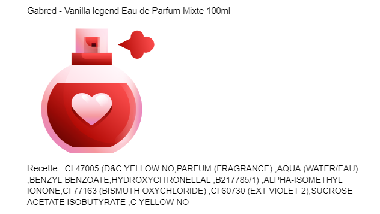

# FRAGRAI 

Create fragrance with IA

# But du Projet

Prédire la recette et génerer un nom d'un parfum à partir d'un dataset de recette de parfum+la note des clients+nom du parfum et réference

## KIT

 

# Résultat Final



## Requirement:

git </br>
Jupyter notebook (Obligatoire) </br>
requirements librairies (Obligatoire) </br>

## Reproduction

into the shell

```
git clone Sykzen/FRAGRAI
Install requirements into anaconda prompt or jupyter
Uploat dataset.csv and *.ipynb to jupyter notebook

```

## Contributors

- [Sykzen](https://github.com/Sykzen)
- [Sarmedd](https://github.com/Sarmedd)
- [Dousey](https://github.com/DouseyTB)

## Sources

- https://www.kaggle.com/code/ishivinal/arabic-name-generator (RNN inspiration)
- https://github.com/simon-larsson/pokemon-name-generator (RNN inspiration)
- https://github.com/antonio-f/Generating-names-with-RNN/blob/master/Generating%20names%20with%20recurrent%20neural%20networks/RNN-task.ipynb (RNN inspiration)
- https://machinelearningmastery.com/adam-optimization-algorithm-for-deep-learning/ (Adam optimization)
- https://keras.io/guides/sequential_model/ (Keras)(RNN inspiration)
- https://www.kaggle.com/c/tensorflow-speech-recognition-challenge/discussion/62442#410577 (Tensorflow)
- https://fr.wikipedia.org/wiki/Silhouette_(clustering) (Silhouette)
- https://www.scikit-yb.org/en/latest/api/cluster/elbow.html#:~:text=The%20elbow%20method%20runs%20k,point%20to%20its%20assigned%20center. (Elbow)
- https://scikit-learn.org/stable/modules/generated/sklearn.cluster.KMeans.html (KMeans)
